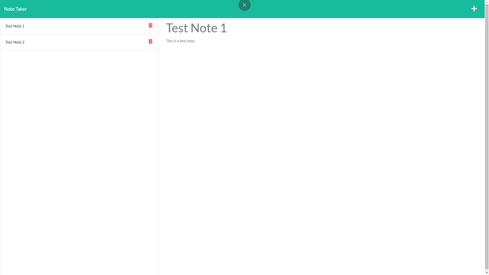

# note-taker
A simple note taking application that utilizes express.js to allow users to write, save, and delete notes. Notes are saved to a database and all data is persistant.
  
Below is the link to the deployed application through Heroku.

[Heroku](https://note-taker-jioriatti.herokuapp.com/)    
  
    
      

